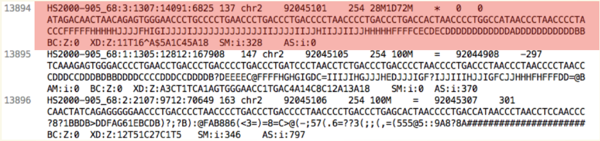

```{r setup, include=FALSE}
knitr::opts_chunk$set(echo = TRUE)
AsSlides <- TRUE
library(DESeq2)
library(GenomicAlignments)
library(Rsubread)
```


```{r, results='asis',include=TRUE,echo=FALSE}
if(params$isSlides != "yes"){
  cat("# Crispr Screenining analysis in R

---
"    
  )
  
}

```

## High-throughput Crispr Screening 

High-throughput Crispr or shRNA screening provides a method to simultaneously assess the functional roles of 1000s genes under specific conditions/perturbations.


---
## Analysis of Crispr screens

We can take advantage of high throughput sequencing to assess the abundance of cells containing each CrispR/shRNA. 

By comparing the abundance of CrispR/shRNA in test conditions versus control conditions we can assess which genes have a functional role related to the test condition. i.e. If a set  sgRNA guides targeting are enriched after drug treatment, that gene is important to susceptiabilty to the drug.

---
## Tools for analysis

There are many tools available to analyse sgRNA/shRNA screens. These incude the popular PinAPL-Py and MAGeCK toolsets.

[PinAPL-Py: A comprehensive web-application for the analysis of CRISPR/Cas9 screens](https://www.nature.com/articles/s41598-017-16193-9)

[MAGeCK enables robust identification of essential genes from genome-scale CRISPR/Cas9 knockout screens](https://genomebiology.biomedcentral.com/articles/10.1186/s13059-014-0554-4)

---
## Tools in R.

Much of the tools used in these toolsets are implemented within R (PinAPL=Py uses Bowtie, MAGeCK uses very similar normalisations to DESeq.

We can therefore use some of the skills we have learnt to deal with other high throughput sequencing data and then apply it to identifying enriched sgRNA/shRNAs in our test conditions versus control.


---
## PinAPL-Py

[PinAPL-Py](https://www.nature.com/articles/s41598-017-16193-9) offers a python/command line and web GUI interface to sgRNA screen analysis.
 
We will follow some of their methods and use their test datasets in our upcoming analysis.

You can find the GUI and test datasets available [here.](http://pinapl-py.ucsd.edu)


---
## Download the data

We will use their test data and results data from this GUI. 

We can download this directly by using the download.file command

```{r downloadFile,message=FALSE}
download.file("https://github.com/LewisLabUCSD/PinAPL-Py/archive/master.zip","pieappleData.zip")
unzip("pieappleData.zip")
download.file("http://pinapl-py.ucsd.edu/example-data","TestData.zip")
unzip("TestData.zip")
download.file("http://pinapl-py.ucsd.edu/run/download/example-run","Results.zip")
unzip("Results.zip")
```


---
## Quality control of FastQ

Once we have downloaded the raw fastQ data (either from their Gtihub or from SRA) we can use the [ShortRead package](https://bioconductor.org/packages/release/bioc/html/ShortRead.html) to review our sequence data quality.

We have reviewed how to work with raw sequencing data in the [**FastQ in Bioconductor** session.](https://rockefelleruniversity.github.io/Bioconductor_Introduction/presentations/slides/FastQInBioconductor.html#1)

First we load the [ShortRead library.](https://bioconductor.org/packages/release/bioc/html/ShortRead.html)


```{r shortreada,include=FALSE}
library(ShortRead)

```

```{r shortread, warning=F, message=F}
library(ShortRead)
```

---
## Working with FQs from Crispr screen.

First we will review the raw sequencing reads using functions in the [ShortRead package.](https://bioconductor.org/packages/release/bioc/html/ShortRead.html) This is similar to our QC we performed for RNAseq and ChIPseq. 

We do not need to review all reads in the file to can gain an understanding of data quality. We can simply review a subsample of the reads and save ourselves some time and memory.

**Remember** when we subsample we retrieve random reads from across the entire fastQ file. This is important as fastQ files are often ordered by their position on the sequencer.

---
## Crispr screen FQs.

We can subsample from a fastQ file using functions in **ShortRead** package.

Here we use the [**FastqSampler** and **yield** function](https://rockefelleruniversity.github.io/Bioconductor_Introduction/presentations/slides/FastQInBioconductor.html#41) to randomly sample a defined number of reads from a fastQ file. Here we subsample 1 million reads.

```{r crsiprRep1Reads,echo=T,eval=T}
fqSample <- FastqSampler("PinAPL-Py-master/Data/Tox-A_R01_98_S2_L008_R1_001_x.fastq.gz",n=10^6)
fastq <- yield(fqSample)
```

---
## Working with Crispr fastQ

The resulting object is a [ShortReadQ object](https://rockefelleruniversity.github.io/Bioconductor_Introduction/presentations/slides/FastQInBioconductor.html#10) showing information on the number of cycles, base pairs in reads, and number of reads in memory.

```{r mycRep1ReadsShortReadQ}
fastq
```

---

## Working with Crispr fastQ

If we wished, we can assess information from the fastQ file using our [familiar accessor functions.](https://rockefelleruniversity.github.io/Bioconductor_Introduction/presentations/slides/FastQInBioconductor.html#15)

* **sread()** - Retrieve sequence of reads.
* **quality()** - Retrieve quality of reads as ASCI scores.
* **id()** - Retrieve IDs of reads.


```{r mycRep1ReadsAccessor}
readSequences <- sread(fastq)
readQuality <- quality(fastq)
readIDs <- id(fastq)
readSequences
```

---
## Working with Crispr fastQ

We can check some simple quality metrics for our subsampled fastQ data.

First, we can review the overall reads' quality scores.

We use the [**alphabetScore()** function with our read's qualitys](https://rockefelleruniversity.github.io/Bioconductor_Introduction/presentations/slides/FastQInBioconductor.html#28) to retrieve the sum quality for every read from our subsample.


```{r mycRep1ReadsQScores}
readQuality <- quality(fastq)
readQualities <- alphabetScore(readQuality)
readQualities[1:10]
```

---

## Working with Crispr fastQ

We can then produce a histogram of quality scores to get a better understanding of the distribution of scores.

```{r mycRep1ReadsQScoresPlot,fig.height=3,fig.width=8}
library(ggplot2)
toPlot <- data.frame(ReadQ=readQualities)
ggplot(toPlot,aes(x=ReadQ))+geom_histogram()+theme_minimal()
```


---

## Working with Crispr fastQ

We can review the occurrence of DNA bases within reads and well as the occurrence of DNA bases across sequencing cycles using the [**alphabetFrequency()**](https://rockefelleruniversity.github.io/Bioconductor_Introduction/presentations/slides/FastQInBioconductor.html#18) and [**alphabetByCycle()**](https://rockefelleruniversity.github.io/Bioconductor_Introduction/presentations/slides/FastQInBioconductor.html#30) functions respectively.

Here we check the overall frequency of **A, G, C, T and N (unknown bases)** in our sequence reads.

```{r mycRep1ReadsAlpFreq}
readSequences <- sread(fastq)
readSequences_AlpFreq <- alphabetFrequency(readSequences)
readSequences_AlpFreq[1:3,]
```


---

## Working with Crispr fastQ

Once we have the frequency of DNA bases in our sequence reads we can retrieve the sum across all reads.

```{r mycRep1ReadsAlpFreqSum}
summed__AlpFreq  <- colSums(readSequences_AlpFreq)
summed__AlpFreq[c("A","C","G","T","N")]
```

---

## Working with Crispr fastQ

We can review DNA base occurrence by cycle using the [**alphabetByCycle()** function.](https://rockefelleruniversity.github.io/Bioconductor_Introduction/presentations/slides/FastQInBioconductor.html#30)

```{r mycRep1ReadsAlpByCycle}
readSequences_AlpbyCycle <- alphabetByCycle(readSequences)
readSequences_AlpbyCycle[1:4,1:10]
```

---

## Working with Crispr fastQ

We often plot this to visualise the base occurrence over cycles to observe any bias.
First we arrange the base frequency into a data frame.

```{r mycRep1ReadsAlpByCyclePlot}
AFreq <- readSequences_AlpbyCycle["A",]
CFreq <- readSequences_AlpbyCycle["C",]
GFreq <- readSequences_AlpbyCycle["G",]
TFreq <- readSequences_AlpbyCycle["T",]
toPlot <- data.frame(Count=c(AFreq,CFreq,GFreq,TFreq),
                     Cycle=rep(1:max(width(readSequences)),4),
                     Base=rep(c("A","C","G","T"),each=max(width(readSequences))))

```

---

## Working with Crispr fastQ

Now we can plot the frequencies using ggplot2

```{r mycRep1ReadsAlpByCyclePlot2,fig.height=4,fig.width=8}

ggplot(toPlot,aes(y=Count,x=Cycle,colour=Base))+geom_line()+
  theme_bw()
```

---

## Assess by cycle with raw Crispr data

We can also assess mean read quality over cycles. This will allow us to identify whether there are any isses with quality dropping off over time.

For this we use the [**as(*read_quality*,"matrix")**](https://rockefelleruniversity.github.io/Bioconductor_Introduction/presentations/slides/FastQInBioconductor.html#29) function first to translate our ASCI quality scores to numeric quality scores.

```{r mycRep1ReadsQByCycle}
qualAsMatrix <- as(readQuality,"matrix")
qualAsMatrix[1:2,]
```

---

## Assess by cycle with raw Crispr data

We can now [visualise qualities across cycles using a lineplot.](https://rockefelleruniversity.github.io/Bioconductor_Introduction/exercises/answers/fastq_answers.html)

```{r mycRep1ReadsQByCyclePlotfig.width=8,fig.height=4}
toPlot <- colMeans(qualAsMatrix)
plot(toPlot)
```

---

## Assess by cycle with raw Crispr data

In this case the distribution of reads quality scores and read qualities over time look okay. We will often want to access fastQ samples together to see if any samples stick out by these metrics.

Here we observed a second population of low quality scores so will remove some reads with low quality scores and high unknown bases.


---
```{r, results='asis',include=TRUE,echo=FALSE}
if(params$isSlides == "yes"){
  cat("class: inverse, center, middle

# Aligning data

<html><div style='float:left'></div><hr color='#EB811B' size=1px width=720px></html> 

---
"    
  )
}else{
  cat("# Aligning data

---
"    
  )
  
}

```


## Aligning reads to sgRNA library

Following assessment of read quality and any read filtering we applied, we will want to align our reads to the sgRNA library so as to quantify sgRNA abundance in our samples.

Since sgRNA screen reads will align continously against our sgRNA we can use [our genomic aligners we have seen in previous sessions.](https://rockefelleruniversity.github.io/Bioconductor_Introduction/r_course/presentations/slides/AlignmentInBioconductor.html#7) The resulting BAM file will contain aligned sequence reads for use in further analysis.

<div align="center">

</div>


---
## Creating a sgRNA reference

First we need to retrieve the sequence information for the sgRNA guides of interest in [FASTA format](https://rockefelleruniversity.github.io/Genomic_Data/presentations/slides/GenomicsData.html#9)

We can read the sequences of our sgRNA probes from the TSV file downloaded from the Github page [here](http://pinapl-py.ucsd.edu/example-data).

```{r fa2}
GeCKO <- read.delim("PinAPL-py_demo_data/GeCKOv21_Human.tsv")
GeCKO[1:2,]
```


---
## Creating a sgRNA fasta

Now we can create a [**DNAStringSet** object from the retrieved sequences](https://rockefelleruniversity.github.io/Bioconductor_Introduction/r_course/presentations/slides/SequencesInBioconductor.html#17) as we have done for full chromosome sequences.

```{r fa3}
require(Biostrings)
sgRNAs <- DNAStringSet(GeCKO$seq)
names(sgRNAs) <- GeCKO$UID
```


---
## Creating a sgRNA fasta


Now we have a **DNAStringSet** object we can use the [**writeXStringSet** to create our FASTA file of sequences to align to.](https://rockefelleruniversity.github.io/Bioconductor_Introduction/presentations/slides/SequencesInBioconductor.html#22)

```{r fa4}
writeXStringSet(sgRNAs,
                file="GeCKO.fa")
```


---
## Creating an Rsubread index 

We will be aligning using the **subjunc** algorithm from the authors of subread. We can therefore use the **Rsubread** package. Before we attempt to align our fastq files, we will need to first build an index from our reference genome using the **buildindex()** function.

The [**buildindex()** function simply takes the parameters of our desired index name and the FASTA file to build index from.](https://rockefelleruniversity.github.io/Bioconductor_Introduction/r_course/presentations/slides/AlignmentInBioconductor.html#14)


The index is quite small so we dont need to split index or worry about memory parameters.

```{r, echo=TRUE,eval=TRUE}
library(Rsubread)
buildindex("GeCKO","GeCKO.fa", 
           indexSplit=FALSE)

```


---
## Rsubread sgRNA alignment

We can align our raw sequence data in fastQ format to the new FASTA file of sgRNA sequences using the **Rsubread** package. Specifically we will be using the **align** function as this utilizes the subread genomic alignment algorithm. 

The [**align()** function accepts arguments for the index to align to, the fastQ to align, the name of output BAM, the mode of alignment (rna or dna) and the phredOffset.](https://rockefelleruniversity.github.io/Bioconductor_Introduction/presentations/slides/AlignmentInBioconductor.html#15)


```{r, echo=TRUE, eval=TRUE}
myFQs <- "PinAPL-py_demo_data/Control_R1_S14_L008_R1_001_x.fastq.gz"
myMapped <- align("GeCKO",myFQs,output_file = gsub(".fastq.gz",".bam",myFQs),
                  nthreads=4,unique=TRUE,nBestLocations=1,type = "DNA")

```

---
## Rsubread sgRNA alignment

We can now assess how well our alignment has done by reviewing the total number of mapped reads output by the **align** function.

```{r, echo=TRUE,eval=TRUE}

myMapped 

```

---
## Rsubread sgRNA alignment

To see why we have been unable to map we can look at the Rsubread manual and review the [guide for mapping to miRNAs.](https://bioconductor.org/packages/release/bioc/vignettes/Rsubread/inst/doc/SubreadUsersGuide.pdf). 

We can see here that the problem is that we need to reduce the number of subreads required for accepting a hit. We can control this with the **TH1** parameter which we now set ot 1.


```{r, echo=TRUE, eval=TRUE}
myFQs <- "PinAPL-py_demo_data/Control_R1_S14_L008_R1_001_x.fastq.gz"
myMapped <- align("GeCKO",myFQs,output_file = gsub(".fastq.gz",".bam",myFQs),
                  nthreads=4,unique=TRUE,nBestLocations=1,type = "DNA",TH1 = 1)

```

---
## Rsubread sgRNA alignment

We can now see we have mapped around 80% of the reads uniquely to sgRNA library.

```{r, echo=TRUE,eval=TRUE}

myMapped 

```


---
## Rsubread ChIPseq alignment

We will be more conservative now and exclude any reads with mismatches and indels (insertions/deletions) from our aligned data.


```{r, echo=TRUE, eval=TRUE}
myFQs <- "PinAPL-py_demo_data/Control_R1_S14_L008_R1_001_x.fastq.gz"
myMapped <- align("GeCKO",myFQs,output_file = gsub(".fastq.gz",".bam",myFQs),
                  nthreads=4,unique=TRUE,nBestLocations=1,type = "DNA",TH1 = 1,
                  maxMismatches = 0,indels = 0)

```

---
## Rsubread sgRNA alignment

With a little more stringency we have expected less alignment. This alignment rate is in keeping with observed results from the PinAPL-Py.

```{r, echo=TRUE,eval=TRUE}

myMapped 

```


---
## Rsubread sgRNA aligned data

We can use the **GenoomicAlignments** package to read in our newly created BAM file using the **readGAlignments** function. 

```{r, echo=TRUE,eval=TRUE}
require(GenomicAlignments)
temp <- readGAlignments(gsub(".fastq.gz",".bam",myFQs))
temp
```

---
## Rsubread sgRNA aligned data

Now we can review the alignments we can see how Rsubread has dealt with read sequences longer than the sgRNA to align to.

As we can see in the cigar strings, subread has softcliped the start and end of reads around the point of alignment and so removed adaptors as part of alignment.

```{r, echo=TRUE,eval=TRUE}
temp
```

---
## Rsubread sgRNA aligned data

We can then review where the softclipping and matches occur in our read by interrogating these cigar strings using the **cigar** functions to extract them from our GAlignements object.

```{r, echo=TRUE,eval=TRUE}
cigars <- cigar(temp)
cigars[1:5]
```

---
## Rsubread sgRNA aligned data

We can use the **cigarToRleList** function to turn our cigar strings into a list of RLE objects.

```{r, echo=TRUE,eval=TRUE}
cigarRLE <- cigarToRleList(cigars)
cigarRLE[1]
```

---
## Rsubread sgRNA aligned data

And as our reads are all the same length we can now turn our list of RLEs into a matrix of cigar values with rows representing reads and columns the cycles acorss the reads.

```{r, echo=TRUE,eval=TRUE}
cigarMat <- matrix(as.vector(unlist(cigarRLE)),ncol=50,byrow = TRUE)
cigarMat[1:2,]
```

---
## Rsubread sgRNA aligned data

From this we can now get the frequency of S or M using the table function.

```{r, echo=TRUE,eval=TRUE}
cigarFreq <- apply(cigarMat,2,table)
cigarFreq[1:2,]
```

---
## Rsubread sgRNA aligned data

With this frequency table we can construct a ggplot to show the distibution of soft-clips and matches across the read.

```{r, echo=TRUE,eval=TRUE,fig.height=3,fig.width=8}
require(ggplot2)
toPlot <- data.frame(Freq=c(cigarFreq["S",],cigarFreq["M",]),
                      Cigar=rep(c("S","M"),each=ncol(cigarFreq)),
                      Cycle=rep(seq(1,ncol(cigarFreq)),2))
ggplot(toPlot,aes(x=Cycle,y=Freq,colour=Cigar))+geom_line()+theme_bw()
```

---
## Rsubread counts per sgRNA

To obtain the counts per sgRNA we can simply take the frequncy of contig occurrence. 

```{r, echo=TRUE,eval=TRUE}
counts <- data.frame(table(seqnames(temp)),row.names = "Var1")
counts[1:2,,drop=FALSE]
```

---
## Rsubread counts per sgRNA

We can now compare to the counts from the same file retreived from PinAPL-Py.

```{r, echo=TRUE,eval=TRUE,fig.height=3,fig.width=8}
ss <- read.delim("New_Example_1580342908_4/Analysis/01_Alignment_Results/ReadCounts_per_sgRNA/Control_1_GuideCounts.txt")
new <- merge(ss,counts,by.x=1,by.y=0)
plot(new$X0,new$Freq)
```

---
## Rsubread counts per sgRNA

This looked quite different for low counts. We will also add 1 more additional filter to screen out reads with less than 20 matches.

```{r, echo=TRUE,eval=TRUE,fig.height=3,fig.width=8}
counts <- data.frame(table(seqnames(temp[width(temp) == 20])),row.names = "Var1")
new <- merge(ss,counts,by.x=1,by.y=0)
plot(new$X0,new$Freq)
```


---
## Rsubread counts per sgRNA

Now we can align the reads and count sgRNAs we could run the counting over each of our files of interest. I have done this already and provide a solution in the exercises based on the previous slides. 

For now we can work with the result stored in a matrix object called **sgRNAcounts**.

```{r, echo=TRUE}
load("data/sgRNACounts.RData")
sgRNAcounts[1:4,]
```

---
## Rsubread counts per sgRNA

To normalise our data and test for enrichment we will use the DESeq2 package. 

First we need to constuct our DESeqDataset object using familiar **DESeqDataSetFromMatrix** function

```{r, echo=TRUE}
library(DESeq2)
metadata <- DataFrame(Group=factor(c("Control","Control","ToxB","ToxB"),
                                   levels = c("Control","ToxB")),
                      row.names = colnames(sgRNAcounts))
dds <- DESeqDataSetFromMatrix(sgRNAcounts,colData = metadata,design = ~Group)
```

---
## Rsubread counts per sgRNA

Now we have our DESeqDataset object we can use the DESeq function to normalise and test for enrichment.

```{r, echo=TRUE}
dds <- DESeq(dds)
```

---
## Rsubread counts per sgRNA

A useful QC with sgRNA enrichment analysis is to review the distribution of counts for sgRNA guides before and after treatment. Here we extract the normalised counts and plot the distbutions of log2 counts for sgRNAs as a boxplot.

```{r, echo=TRUE,fig.height=3,fig.width=8}
normCounts <- counts(dds,normalized=TRUE)
boxplot(log2(normCounts+0.1))
```


---
## Rsubread counts per sgRNA

To identify sgRNAs enriched in our Tox condition we can now use the standard differential analysis of DESeq2 by way of the **results** function.

```{r, echo=TRUE}
ToxBvsControl <- results(dds,contrast=c("Group","ToxB","Control"))
ToxBvsControl <- ToxBvsControl[order(ToxBvsControl$pvalue),]
ToxBvsControl
```


---
## Rsubread counts per sgRNA

We can now compare our results to those provided by PinAPL-py. Although there us some differences the correlation here is 99%.

```{r, echo=TRUE,fig.height=3,fig.width=8}
ss <- read.delim("New_Example_1580342908_4/Analysis/02_sgRNA-Ranking_Results/sgRNA_Rankings/ToxB_avg_0.01_Sidak_sgRNAList.txt")
toPlt <- merge(ss,as.data.frame(ToxBvsControl),by.x=1,by.y=0)
corr <- cor(log2(toPlt[!is.na(toPlt$padj),]$fold.change),toPlt[!is.na(toPlt$padj),]$log2FoldChange)
plot(log2(toPlt[!is.na(toPlt$padj),]$fold.change),toPlt[!is.na(toPlt$padj),]$log2FoldChange,main=corr)
```

---
## sgRNA to Gene

We now would want to identify genes whose sgRNAs are enriched. Most sgRNA libraries will have multiple sgRNA guides for a single gene and so we can use makes use of these in selected genes of interest.

Two main approaches are to either set a cut-off for number of enriched sgRNAs per gene or to produce an aggregate score of sgRNAs for a gene. 

Here we will employ the first strategy.


---
## sgRNA to Gene

We can first identify which sgRNAs were significantly enriched in ToxB.


```{r}
ToxBvsControl <- as.data.frame(ToxBvsControl)[order(ToxBvsControl$pvalue),]
ToxBvsControl$Enriched <- !is.na(ToxBvsControl$padj) & ToxBvsControl$pvalue < 0.05 &ToxBvsControl$log2FoldChange > 0
ToxBvsControl[1:2,]
```

---
## sgRNA to Gene

We also need to add some information of sgRNA to gene. This is available in the same file containing the sequence information.

```{r}
ToxBvsControl <- merge(GeCKO,ToxBvsControl,by.x=2,by.y=0)
ToxBvsControl[1:2,]
```

---
## sgRNA to Gene

We can now loop through our sgRNA results and summarise to the gene level.

```{r,eval=FALSE}
genes <- unique(ToxBvsControl$gene_id)
listofGene <- list()
for(i in 1:length(genes)){
  tempRes <- ToxBvsControl[ToxBvsControl$gene_id %in% genes[i],]
  meanLogFC <- mean(tempRes$log2FoldChange,na.rm=TRUE)
  logFCs <- paste0(tempRes$log2FoldChange,collapse=";")
  minPvalue <- min(tempRes$pvalue,na.rm=TRUE) 
  pvalues <- paste0(tempRes$pvalue,collapse=";")
  nEnriched <- sum(tempRes$Enriched,na.rm=TRUE) 
  listofGene[[i]] <- data.frame(Gene=genes[i],meanLogFC,logFCs,minPvalue,pvalues,nEnriched)
}
geneTable <- do.call(rbind,listofGene)
geneTable <- geneTable[order(geneTable$nEnriched,decreasing=TRUE),]
```

---
## sgRNA to Gene

Finally we can set a cut-off of enrichment by at least two guides and select genes to investigate further.

```{r,include=FALSE}
load("data/geneTable.RData")
```

```{r}
geneTable[1:3,]
```


```{r, echo=TRUE,eval=FALSE,include=FALSE}
myFQs <- c("/Users/thomascarroll/Downloads/PinAPL-py_demo_data/Control_R1_S14_L008_R1_001_x.fastq.gz", "/Users/thomascarroll/Downloads/PinAPL-py_demo_data/Control_R2_S15_L008_R1_001_x.fastq.gz", "/Users/thomascarroll/Downloads/PinAPL-py_demo_data/ToxA_R1_98_S2_L008_R1_001_x.fastq.gz", "/Users/thomascarroll/Downloads/PinAPL-py_demo_data/ToxA_R2_S2_L005_R1_001_x.fastq.gz", "/Users/thomascarroll/Downloads/PinAPL-py_demo_data/ToxB_R1_98_S4_L008_R1_001_x.fastq.gz", "/Users/thomascarroll/Downloads/PinAPL-py_demo_data/ToxB_R2_S4_L005_R1_001_x.fastq.gz")
require(GenomicAlignments)
counts <- list()
counts2 <- list()
stats <- list()

for(f in 1:length(myFQs)){
  stats[[f]] <- align("GeCKO",myFQs[f],output_file = gsub(".fastq.gz",".bam",myFQs[f]),
            nthreads=2,unique=TRUE,nBestLocations=1,type = "DNA",TH1 = 1,maxMismatches = 0,indels = 0)
  temp <- readGAlignments(gsub(".fastq.gz",".bam",myFQs[f]))
  counts[[f]] <- data.frame(table(seqnames(temp[width(temp) == "20"])),row.names = "Var1")
  counts2[[f]] <- data.frame(table(seqnames(temp)),row.names = "Var1")
}
myRes <- do.call(cbind,counts)

```

---
# Time for an exercise.

[Link_to_exercises](../../exercises/exercises/crispr_exercise.html)

[Link_to_answers](../../exercises/answers/crisp_answers.html)


